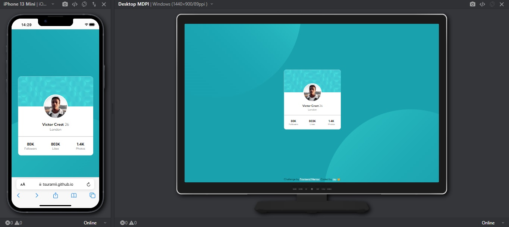

# Frontend Mentor - Profile card component solution

This is a solution to the [Profile card component challenge on Frontend Mentor](https://www.frontendmentor.io/challenges/profile-card-component-cfArpWshJ). Frontend Mentor challenges help you improve your coding skills by building realistic projects. 

## Table of contents

- [Overview](#overview)
  - [The challenge](#the-challenge)
  - [Screenshot](#screenshot)
  - [Links](#links)
- [My process](#my-process)
  - [Built with](#built-with)
  - [What I learned](#what-i-learned)

## Overview

### The challenge

- Build out the project to the designs provided

### Screenshot



### Links

- Solution URL: [My Frontend Mentor Solution](https://www.frontendmentor.io/solutions/profile-card-component-with-tailwindcss-4SzAJJsb1J)
- Live Site URL: [GitHub pages deploy](https://tsuramii.github.io/profile-card-component-main/)

## My process

### Built with

- Semantic HTML5 markup
- Flexbox
- CSS Grid
- Mobile-first workflow
- [Tailwind](https://tailwindcss.com) - CSS Framework

### What I learned

One of the standout skills I acquired during this project was the ability to create custom backgrounds using Tailwind CSS. This allowed me to enhance the visual appeal of my web applications. Here's an example of how to define custom backgrounds in your Tailwind CSS configuration:

```js
backgroundImage: {
  'patterntop': "url('./images/bg-pattern-top.svg')",
  'patternbot': "url('./images/bg-pattern-bottom.svg')"
}
```
